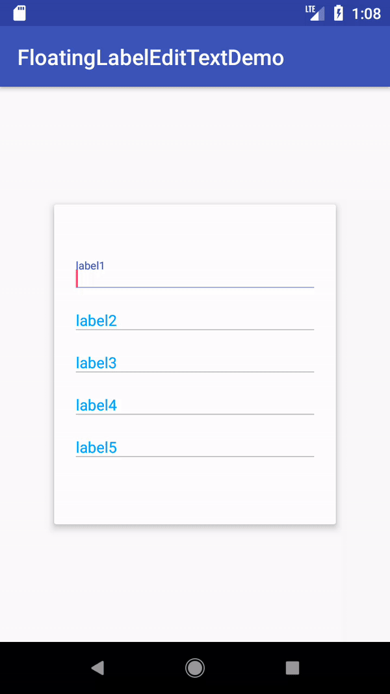
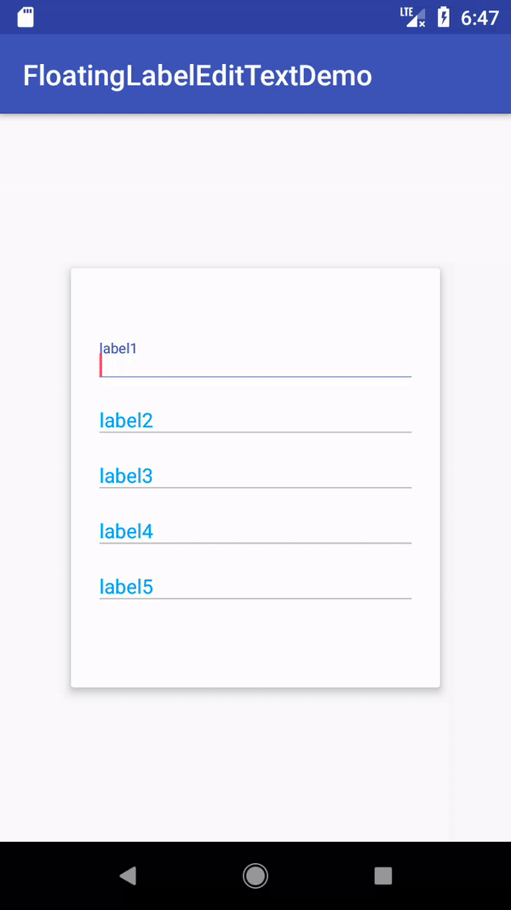

# Developing...

# Android浮动字文本-FloatingLabelEditText

[](https://www.apache.org/licenses/LICENSE-2.0)
[](https://android-arsenal.com/api?level=14)
[](https://jitpack.io/#james602152002/FloatingLabelEditText)
[](https://travis-ci.org/james602152002/FloatingLabelEditText)
[](https://codecov.io/gh/james602152002/FloatingLabelEditText)

## [English](README_EN.md) | 中文

一般浮动字体文本设置自定义图标仅支持png格式，不支持Icon Font形式，也无法设置图标大小。效果与TextInputLayout相比略差一截，故开发此控件。

## 特点功能:

 - 支持代码更改字体大小(包含浮动文字、提示文字、错误文字)
 - 支持代码设置提示、分割线以及错误状态下的颜色 
 - 支持ttf设置EditText左侧图标
 - 错误文字的字数太多会以跑马灯动画展示
 - 浮动文字显示字数过多以ellipsize展示
 - 浮动文字支持ForegroundColorSpan
 
## Demo
 - [下载 APK-Demo](art/demo.apk)
 - [示例网址](https://github.com/james602152002/FloatingLabelEditTextDemo)
 
## 项目演示
 
 |错误/浮动效果|跑马灯效果|
 |:---:|:---:|
 |||
 
 [更多效果](common_md/DEMONSTRATION_CH.md)
 
## 依赖:
 
 ```
 allprojects {
 	repositories {
 		...
 		maven { url 'https://jitpack.io' }
 	}
 }
 ```
 
 ```
 dependencies {
 	compile 'com.github.james602152002:FloatingLabelEditText:1.0.0'
 }
 ```
 
 ## 属性
 ```xml
 <com.james602152002.floatinglabeledittext.FloatingLabelEditText
           //设置获取焦点状态下的颜色
           app:j_fle_colorHighlight="#0000FF" 
           //设置分割线未获取状态下的颜色
           app:j_fle_colorDivider="#FF00FF"
           //设置错误状态下的颜色
           app:j_fle_colorError="#0000FF"
           //设置Label提示文字
           app:j_fle_hint="label"
           //设置divider厚度
           app:j_fle_thickness="2dp"
           //设置label水平间距
           app:j_fle_label_horizontal_margin="2dp"
           //设置label垂直间距
           app:j_fle_label_vertical_margin="2dp"
           //设置错误文字水平间距
           app:j_fle_error_horizontal_margin="2dp"
           //设置错误文字垂直间距
           app:j_fle_divider_vertical_margin="2dp"
           //设置浮动文字大小
           app:j_fle_label_textSize="14sp"
           //设置错误文字大小
           app:j_fle_error_textSize="14sp"
           //浮动文字动画时间(单位：毫秒)
           app:j_fle_float_anim_duration="800"
           //错误动画滚动时间(单位：毫秒)
           app:j_fle_error_anim_duration="8000"
           //错误模式关闭(默认打开)
           app:j_fle_error_disable="true"
           />
           
 ```
 
 ## 方法
 ```java
 public void setting(){
    //设置获取焦点状态下的颜色
    setHighlightColor(int color);
    //设置分割线未获取状态下的颜色
    setDivider_color(int divider_color);
    //设置错误状态下的颜色
    setError_color(int error_color);
    //设置Label提示文字
    setLabel(CharSequence hint);
    //设置divider厚度
    setThickness(int thickness);
    //设置label水平间距
    setLabelMargins(int horizontal_margin, int vertical_margin);
    //设置错误文字水平间距
    setErrorMargin(int horizontal_margin);
    //设置分割线间距(单位：毫秒)
    setDivider_vertical_margin(int divider_vertical_margin);
    //设置浮动文字大小
    setLabel_text_size(float label_text_size);
    //设置错误文字大小
    setError_text_size(float error_text_size);
    //浮动文字动画时间(单位：毫秒)
    setAnimDuration(int ANIM_DURATION);
    //错误动画滚动时间(单位：毫秒)
    setErrorAnimDuration(int ERROR_ANIM_DURATION);
    //开启错误模式
    setError_enabled();
    //关闭错误模式
    setError_disabled();
 }
 
 ```
 ## 混淆
 
 无需混淆代码。
 
 ## 赞赏
 
 如果觉得效果写得不错，欢迎赏小弟一口蛋白粉 :)
 
 |微信|支付宝|
 |:---:|:---:|
 |||
 
 License
 -------
 
     Copyright 2018 james602152002
 
     Licensed under the Apache License, Version 2.0 (the "License");
     you may not use this file except in compliance with the License.
     You may obtain a copy of the License at
 
        http://www.apache.org/licenses/LICENSE-2.0
 
     Unless required by applicable law or agreed to in writing, software
     distributed under the License is distributed on an "AS IS" BASIS,
     WITHOUT WARRANTIES OR CONDITIONS OF ANY KIND, either express or implied.
     See the License for the specific language governing permissions and
     limitations under the License.